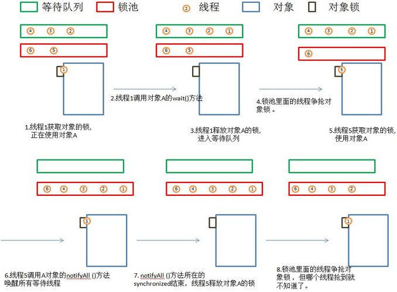

# Java并发机制的底层实现原理
Java代码会编译成字节码，字节码会被类加载器加载到JVM里，JVM将字节码转换为汇编指令在CPU上执行所以Java中的并发机制依赖于JVM的实现与CPU的指令

## volatile的应用
synchronized和violate在并发编程中有着重要作用，violate是轻量级的synchronized，它保证了多处理器开发时的共享变量的可见性。当一个线程修改一个共享变量时，另外一个线程可以读到这个修改的值，violate比synchronized使用和执行成本更低，它不会引起线程上下文的切换和调度

### volatile的定义与实现原理
volatile定义：
>Java编程语言允许线程访问共享变量，为了确保共享变量能被准确和一致的更新，线程应该确保通过排他锁单独获得这个变量。

CPU与内存通信模型：
>为了提高处理速度，处理器不直接与内存进行通信，而是将需要的内存数据读取到CPU内部缓存（L1、L2或者其他）中后在内部缓存中进行操作，但不知道何时会将内部缓存写回主内存

缓存行：
>缓存中k可以分配的最小存储单元

实现原理：
>如果变量被violate修饰，JVM将字节码转化为汇编指令时,会多出一条Lock前缀的指令,此指令的作用有两点
>>1. 将当前处理器的缓存行数据写回到系统主内存
>>2. 这个写回操作会导致其他处理器中缓存了该内存地址的数据无效

### volatile的使用优化
并发包中队列集合类LinkedTransferQueue，它在使用volatile变量时，用一种追加字节的方式来优化队列出队和入队的性能
```java
// 队列中的头部节点
private transient final PaddedAtomicReference<QNode> head;
// 队列中的尾部节点 
private transient final PaddedAtomicReference<QNode> tail;

static final class PaddedAtomicReference <T> extends AtomicReference <T> {
// 使用很多4个字节的引用追加到64个字节
    Object p0, p1, p2, p3, p4, p5, p6, p7, p8, p9, pa, pb, pc, pd, pe;
    PaddedAtomicReference(T r) {
        super(r);
    }
}
public class AtomicReference <V> implements java.io.Serializable {
    private volatile V value;
    // 省略其他代码
｝

```

原理：
>每个对象引用占4个字节，PaddedAtomicReference追加了15个对象，使该对象的占用64个字节。对于Intel酷睿7、Pentium M等处理器的L1、L2缓存的高速缓存行是64个字节宽，如果队列的头尾结点不足64个字节的话，会读取到同一个缓存行中，当一个处理器试图修改头/尾结点时，会锁定该缓存行，在缓存一致性的机制下，会导致其他处理器不能访问尾结点，队列的入队出队会频繁访问头尾结点，所以严重影响效率，将头尾结点追加到64字节，避免加载到同一个缓存行内，使头尾结点修改时不会相互锁定

下列不适用将volatile变量追加到64字节的情况：
1. 缓存行非64字节宽的处理器
>P6系列、奔腾处理器缓存32个字节宽
2. 共享变量不会被频繁地写

---
## synchronized实现原理与应用

Java中每一个对象都可以作为锁。具体表现为以下3种形式：
1. 对于普通同步方法，锁当前实例对象
2. 对于静态同步方法，锁当前类的Class对象
3. 对于同步方法块，锁synchronized内配置的对象

###基本概念
* 机器码（机器语言）
> 由机器指令集构成，能直接被机器执行（用二进制代码表示的计算机能直接识别和执行的一种机器指令的集合）。一条指令就是机器语言的一条语句，是一组有意义的二进制代码，指令的基本格式如操作码字段和地址码字段，操作码指明操作指令的性质和作用，地址码给出操作数或者操作数的地址

* 竞态条件
>两个或者多个进程读写某些共享数据，而最后的结果取决于进程运行的准确时序，称为竞态条件。

* 临界区
> 临界区意味着这个区域是敏感的，因为一旦进程运行到这个区域，那么意味着会对公共数据区域或者文件进行操作，也意味着有可能有其它进程也正运行到了临界区。如果能够采用适当的方式，使得这两个进程不会同时处于临界区，那么就能避免竞态条件。

* 原语
>内核提供给核外调用的过程或者函数，原语在执行过程中不允许中断。原语由若干个机器指令构成的完成某种特定功能的一段程序，具有不可分割性。即原语的执行必须是连续的，中途不允许被中断

* 操作系统提供的同步原语

    1.sleep 
    > 将调用的进程阻塞
                            
    2.wakeup
    > 另外一个进程调用wakeup(xx) 去唤醒xx进程
    
    3.信号量（semaphore）
    > 由于一个进程的阻塞和唤醒是在不同的进程中进行的，所以存在中断的可能，比如进程A由进程B唤醒，但由于时钟中断，进程B先执行了wakeup，之后进程A才执行sleep，此时没有进程去唤醒进程A。
    >
    > 因此需要额外引入一个变量来记录，此变量记录了唤醒的次数。每次被其他线程唤醒，此值+1，进行sleep时，如果被其他线程唤醒过了，则不需要进入阻塞状态
    >
    > 对信号量有两种操作down(P操作)、up(V操作)
    >
    > down操作对应sleep，他会先检测信号量是否大于0，若大于0则-1，此时无需阻塞，相当于消耗了一次wakeup；弱信号量为0，则进入阻塞状态
    >
    > up操作对应wakeup，进行 up 操作后，如果发现有进程阻塞在这个信号量上，那么系统会选择其中一个进程将其唤醒，此时信号量的值不需要变化，但被阻塞的进程已经少了一个；如果 up 操作时没有进程阻塞在信号量上，那么它会将信号量的值加1。
    
    4.互斥量（mutex）
    > 互斥量（mutex）其实是信号量的一种特例，它的值只有 0 和 1，当我们不需要用到信号量的计数能力时，我们可以使用互斥量，实际上也意味着临界区值同一时间只允许一个进程进入，而信号量是允许多个进程同时进入临界区的。
    >

* java中的monitor机制           
>使用mutex、semaphore进行开发需要小心的控制down和up操作，所以抽象出更高层次的原语monitor，此原语操作系统不提供，一般由各种语言自行实现
>
>monitor机制的特点就是同一时间只有一个进程/线程能进入monitor种定义的临界区，这使的monitor能达到互斥的效果，但仅仅这样是不足够的，无法进入临界区的进程/线程应该在等待，等待到必要的时候被唤醒，所以monitor也需要提供这样的机制
>
>monitor机制需要几个条件
>* 临界区
>>临界区用来定义互斥的区域
>* monitor对象
>>monitor对象维护基于mutex原语实现的锁以及相应的保存处在等待状态的线程队列，处于锁池的线程队列，以及对外提供两个API，wait和notify来让线程进入阻塞状态以及之后被唤醒

### Java语言对monitor的实现
1. synchronized指定临界区
2. 在使用synchronized时，往往需要指定一个对象与之关联，修饰实例方法时关联this对象，修饰类方法时，关联this.class 此对象为monitor object
3. Java语言种Object对象实现了wait、notify、notifyAll三个Native方法（JVM内部基于C++实现）来使线程进入阻塞状态以及唤醒、Java对象在内存中保存分为三部分对象头、实例数据、对齐充填，其中对象头中包括锁信息，所以Java中任意的对象都可以用作monitor object

等待队列(本是Object里的方法，但影响了线程)
