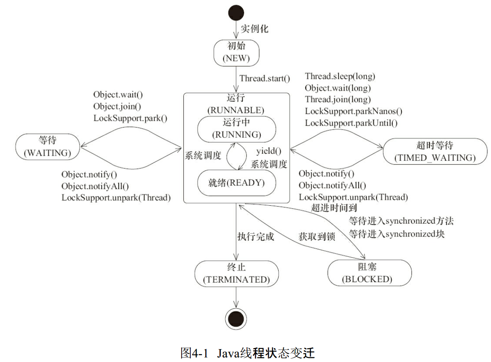

#Java并发编程基础

## 线程简介

### 什么是线程
    现代操作系统在运行一个程序时，会为其创建一个进程。操作系统调度的最小单位是线程，一个进程里可以创建多个线程，线程拥有各自的计数器、堆栈、局部变量等。处理器在各线程上快速切换。
    
### 为什么使用多线程
    1. 更多的处理器核心
    2. 更快的响应时间
    3. 更好的编程模型

### 线程优先级
    操作系统大部分采用时分形式来调度运行的线程。在Java中给线程设置priority来控制优先级，范围1-10，在线程构建的时候可以通过setPriority(int)来设置，优先级高的分配时间片的数量要大于优先级低的，在不同的JVM和系统上，分配存在差异，有些甚至优先级不会生效
    
### 线程状态

| 状态名称 | 说明 |
| :-----: | :----: |
| NEW | 初始状态，线程还没调用start（）方法 |
| RUNNABLE | 运行状态，java将就绪和运行统称为运行中 |
| BLOCKED | 阻塞状态，阻塞于锁 |
| WAITING | 等待状态，线程进入等待状态，需要其他线程唤醒 |
| TIME_WAITING | 超时等待状态，指定时间之后自动返回 |
| TERMINATED | 终止状态，当前线程已经执行完毕 |



### Daemon线程
    Daemon线程是一种支持型线程，因此主要被用作中后台调度和支持性工作，当java虚拟机中不存在非daemon线程时，java虚拟机将会退出，通过调用Thread.setDaemon(true)将线程设置为Daemon线程。Daemon线程中的finally块并不一定会被执行
    
## 线程的启动和终止

### 构造线程
```java
public class Thread implements Runnable {
    private void init(ThreadGroup g, Runnable target, String name,
                          long stackSize, AccessControlContext acc,
                          boolean inheritThreadLocals) {
            if (name == null) {
                throw new NullPointerException("name cannot be null");
            }
    
            this.name = name;
    
            Thread parent = currentThread();
            SecurityManager security = System.getSecurityManager();
            if (g == null) {
                if (security != null) {
                    g = security.getThreadGroup();
                }
    
                if (g == null) {
                    g = parent.getThreadGroup();
                }
            }
    
            g.checkAccess();
    
            if (security != null) {
                if (isCCLOverridden(getClass())) {
                    security.checkPermission(SUBCLASS_IMPLEMENTATION_PERMISSION);
                }
            }
    
            g.addUnstarted();
    
            this.group = g;
            this.daemon = parent.isDaemon();
            this.priority = parent.getPriority();
            if (security == null || isCCLOverridden(parent.getClass()))
                this.contextClassLoader = parent.getContextClassLoader();
            else
                this.contextClassLoader = parent.contextClassLoader;
            this.inheritedAccessControlContext =
                    acc != null ? acc : AccessController.getContext();
            this.target = target;
            setPriority(priority);
            if (inheritThreadLocals && parent.inheritableThreadLocals != null)
                this.inheritableThreadLocals =
                    ThreadLocal.createInheritedMap(parent.inheritableThreadLocals);
            this.stackSize = stackSize;
            tid = nextThreadID();
        }
}
```
如果没有特殊指定，一个新线程会继承parent线程的daemon、priority、contextClassLoader、inheritableThreadLocals，同时会分配一个id来表示这个线程

### 启动线程
调用start（）方法，此方法的含义是：当前线程（即parent）同步告知java虚拟机，只要线程规划器空闲，立刻启动调用start（）方法的线程

### 理解中断
Thread的三个方法
interrupt（）  中断线程，此中断为线程类的一个标志，会把标志置为true，正在运行的线程不会中断，需要自己在线程中进行相应的判断手动中断
isInterrupted（） 判断该线程是否中断
静态方法 Thread.interrupted（） 恢复当前线程的中断标志位

许多抛出InterruptedException的方法（比如Thread.sleep（long））在抛出异常之前会将中断标志位恢复，

废弃的三个方法
suspend()   暂停线程
resume()    恢复线程
stop()      终止线程
suspend方法不会释放锁等资源，会造成死锁问题，stop终止线程时不保证资源的正确释放，所以这三个方法被废弃

### 安全的终止线程
```java
public class Shutdown {
    public static void main(String[] args) throws Exception {
        Runner one = new Runner();
        Thread countThread = new Thread(one, "CountThread");
        countThread.start();
        // 睡眠1秒，main线程对CountThread进行中断，使CountThread能够感知中断而结束
        Thread.sleep(1000);
        countThread.interrupt();
        Runner two = new Runner();
        countThread = new Thread(two, "CountThread");
        countThread.start();
        // 睡眠1秒，main线程对Runner two进行取消，使CountThread能够感知on为false而结束
        Thread.sleep(1000);
        two.cancel();
    }
    private static class Runner implements Runnable {
        private long i;
        private volatile boolean on = true;
        @Override
        public void run() {
            while (on && !Thread.currentThread().isInterrupted()){
                i++;
            }
            System.out.println("Count i = " + i);
        }
        public void cancel() {
            on = false;
        }
    }
}
```
通过调用线程对象的interrupt()或者cancel()方法都可以安全的终止线程，并有机会去清理资源

## 线程间通信
###synchronized实现细节
对于同步代码块，使用monitorenter、monitorexit指令直线，对于同步方法依靠添加方法修饰符ACC_SYNCHRONIZED来实现，本质都是对于对象monitor的获取

### 等待/通知Demo
[等待通知Demo](WaitNotifyDemo.java)

1. 调用wait()、notify()、notifyAll()时需要先对调用对象加锁
2. 调用wait()方法后，线程状态由RUNNING到WAITING，并将线程放到对象的等待队列中
3. notify（）、notifyAll（）调用后，等待线程依旧不会从wait（）返回，需要等待调用notify的线程释放锁后，等待线程才有机会从wait（）返回
4. notify方法把等待队列中的一个线程移到同步队列中，notifyAll把等待队列中的所有线程移到同步队列中，被移动的线程状态由WAITING变为BLOCKED
5. 从wait方法返回的前提时获得了锁

wait/notify机制依托于同步机制, 可以确保等待线程从wait方法返回值能够获取到通知线程对变量做出的修改
### 等待/通知经典范式
等待方
1. 获取对象锁
2. 如果不满足条件，调用锁对象的wait方法，被通知后仍然要检查条件
3. 条件满足则执行对应逻辑
> 伪代码
>
> while(对象) {
>
>   对象.wait();
>
>}
>
>条件满足，执行对应逻辑

通知方
1. 获得对象锁
2. 改变条件
3. 调用等待对象的notify
> 伪代码
>
>synchronized(对象) {
>
>   改变条件
>
>   对象.notifyAll();
>
>}

### 管道输入/输出流
    管道输入/输出流和普通的文件输入/输出流或者网络输入/输出流不同之处在于，它主要在线程间传输数据，媒介为内存
管道输入/输出流包括以下四种实现：PipedOutputStream、PipedInputStream、PipedReader、PipedWriter，前两种面向字节，后两种面向字符
使用时注意将输出流与输入流绑定
```
    PipedWriter in = new PipedWriter();
    PipedReader out = new PipedReader();
    out.connect(in);
```

### Thread.join()
如果一个线程A执行了threadB.join()，意思是，当前线程A等待线程B执行终止后才从threadB.join（）返回，除此之外还提供了join(long millis),join(long millis, long nanos)两个具备超时特性的方法，这两个方法的意思是在给定超时时间内没有终止的话，那么将从该超时方法内返回

join部分源码
```
// 加锁当前线程对象
public final synchronized void join() throws InterruptedException {
    // 条件不满足，继续等待
    while (isAlive()) {
        wait(0);
    }
    // 条件符合，方法返回
}
```

isAlive判断调用join方法的线程是否存活，wait方法将线程A进入等待状态，等线程B执行完后会调用notifyAll来唤醒线程A

###ThreadLocal

线程变量，是一个以ThreadLocal为键，任意对象为值的存储结构。这个结构存储在线程上，就是说，一个可以用一个ThreadLocal对象拿到一个绑定在当前线程上的值。

常用方法：
1. set(T) 设定一个值
2. get() 得到当前线程，threadLocal对象绑定的值
3. initialValue() 设置当前的默认值，当未调用过set设置时直接调用get时会调用此方法进行赋初值

实现原理：

Thread类中存在变量用来存储当前线程的本地变量的Map

 ThreadLocal.ThreadLocalMap threadLocals = null;
 
 ThreadLocalMap基于线性探测法实现的符号表，键值对的Key存储LocalThread实例，值存储任意想存的对象
 
 ThreadLocal通过给每个线程维护独立的变量对象，来实现变量的并发访问问题


