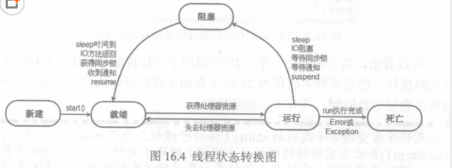

# 基本概念

串行
>所有任务在单线程中排队依次执行

并行
>当系统拥有一个以上CPU资源时，则多线程任务执行时，每个CPU分配一个线程进行执行，线程之间不抢占资源

并发
>当系统仅有一个CPU的资源时，则多线程任务执行时，只能把CPU运行时间分片，再将每个时间片分给各个线程，运行时，某线程代码在执行时，其他线程处于被挂起状态

---
#Java中多线程的实现方法


1.通过继承Thread类创建线程类
>1.定义一个类继承Thread类并重写该类的run方法
>
>2.创建Thread子类的实例，并通过start()方法启动线程
>```java
>public class ThreadOne extends Thread{
>    public static void main(String[] args) {
>        new ThreadOne().start();
>    }
>
>    @Override
>    public void run() {
>        //do something...
>    }
>}
>```
2.实现Runnable接口创建线程类
>1.定义一个类实现Runnable接口并实现该接口的run方法
>
>2.使用Thread(Runnable)构造器创建Thread类，并通过start()方法启动线程
>```java
>public class ThreadOne implements Runnable{
>     public static void main(String[] args) {
>         new Thread(new ThreadOne()).start();
>     }
> 
>     @Override
>     public void run() {
>         //do something
>     }
> }
>```
3.通过Callable和FutureTask创建线程类
>1.定义一个类实现Callable方法并实现该接口的call方法，此方法作为线程的执行体并有返回值
>2.使用FutureTask(Callable)构造器创建FutureTask实例
>3.使用Thread(Runnable)构造器并传入第2步的FutureTask实例创建Thread类，并通过start()方法启动线程
>```java
>public class ThreadOne implements Callable<Integer> {
>     public static void main(String[] args) {
>         Callable<Integer> callable = new ThreadOne();
>         FutureTask<Integer> futureTask = new FutureTask<>(callable);
>         new Thread(futureTask).start();
>     }
> 
>     @Override
>     public Integer call() throws Exception {
>         //do something
>         return null;
>     }
> }
>```

---
##Callable与Runnable实现多线程的区别
>Runnable没有返回值，Callable可以返回执行结果和Future、FutureTask配合获取异步执行结果。FutrueTask.get()可以得到执行结果，但此方法会阻塞主进程继续往下执行直到获取到异步执行结果

---
##线程的生命周期

1.新建状态(NEW)
> 用new关键字和Thread类或其子类建立一个线程对象后，该线程对象就处于新生状态。处于新生状态的线程有自己的内存空间，通过调用start方法进入就绪状态（runnable）。

2.就绪状态(RUNNABLE)
>   处于就绪状态的线程已经具备了运行条件，但还没有分配到CPU，处于线程就绪队列（尽管是采用队列形式，事实上，把它称为可运行池而不是可运行队列。因为cpu的调度不一定是按照先进先出的顺序来调度的），等待系统为其分配CPU。等待状态并不是执行状态，当系统选定一个等待执行的Thread对象后，它就会从等待执行状态进入执行状态，系统挑选的动作称之为“cpu调度”。一旦获得CPU，线程就进入运行状态并自动调用自己的run方法。

3.运行状态(RUNNING)
>处于运行状态的线程可以变为阻塞状态、就绪状态和死亡状态。
>* 处于就绪状态的线程，如果获得了cpu的调度，就会从就绪状态变为运行状态，执行run()方法中的任务。如果该线程失去了cpu资源，就会又从运行状态变为就绪状态。重新等待系统分配资源。也可以对在运行状态的线程调用yield()方法，它就会让出cpu资源，再次变为就绪状态。
>* 当发生如下情况时，线程会从运行状态变为阻塞状态：
>>1. 线程调用sleep方法主动放弃所占用的系统资源
>>2. 线程调用一个阻塞式IO方法，在该方法返回之前，该线程被阻塞
>>3. 线程试图获得一个同步监视器，但更改同步监视器正被其他线程所持有
>>4. 线程在等待某个通知（notify）
>>5. 程序调用了线程的suspend方法将线程挂起。
>* 当线程的run()方法执行完，或者被强制性地终止，例如出现异常，或者调用了stop()、destroy()方法等等，就会从运行状态转变为死亡状态。

4.阻塞状态(BLOCKED)
>在阻塞状态的线程不能进入就绪队列。只有当引起阻塞的原因消除时，如睡眠时间已到，或等待的I/O设备空闲下来，线程便转入就绪状态，重新到就绪队列中排队等待，被系统选中后从原来停止的位置开始继续运行。

5.死亡状态(DEAD)
>当线程的run()方法执行完，或者被强制性地终止，或者出现异常